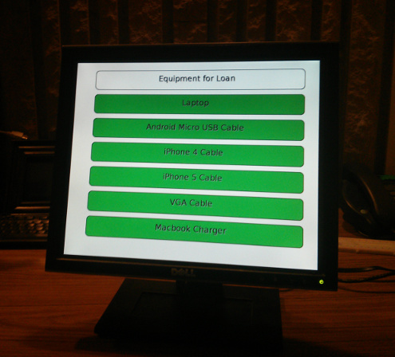
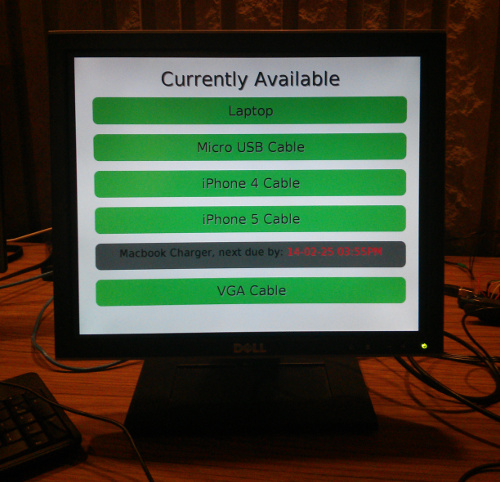

#APE Display#

##Available Portable Equipment Display##

Meant to be used to display the availability of some high turn over items at the Circulation desk. IE, laptops, charge cables etc. Currently meant to run on a Raspberry Pi in kiosk mode as per directions in *pi_setup.txt*. Uses jQuery to make ajaxy screen scrape of the catalogue

###Requirements
- Rasberry Pi 
- jQuery
- PHP access

###Pics###

  

When all items are available  

  

When something is checked out, will display next expected due time  
